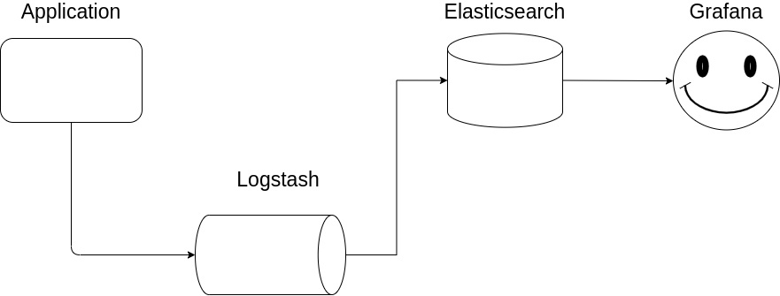

# Business logic:
For any kind of public stream API write the program that calculates count of events (metrics, messages and so on) by minutes and sends it (count) to Elasticsearch (count/timeline graph).  

**Delivery format:**  
Ubuntu VM with bash set env script  

**ES transmission method:**  
logstash  

**Visualization technology:**  
Grafana

# Requirements
**OC:**   
  Centos 7

# How to start
1. Clone this project
1. Place **prepare_environment.sh** script in user's home directory (~/)
1. Write into the [CREDENTIALS.txt](https://github.com/archi144/mephi_ds_bda_hw3_app/blob/master/CREDENTIALS.txt) file with your TwitterStreamingApi keys and put the file in the user's home directory
1. Launch **prepare_environment.sh** via command:
   ```bash
   $ bash prepare_environment.sh
   ```
1. Go to the created directory via command:
   ```bash
   $ vagrant ssh
   ```
1. Go into the **mephi_ds_bda_hw3_infrastructure** directory and launch the script **deploy_infrastructure.sh** via command:
   ```bash
   $ bash deploy_infrastructure.sh
   ```
1. Drink a tea and have fun :)

